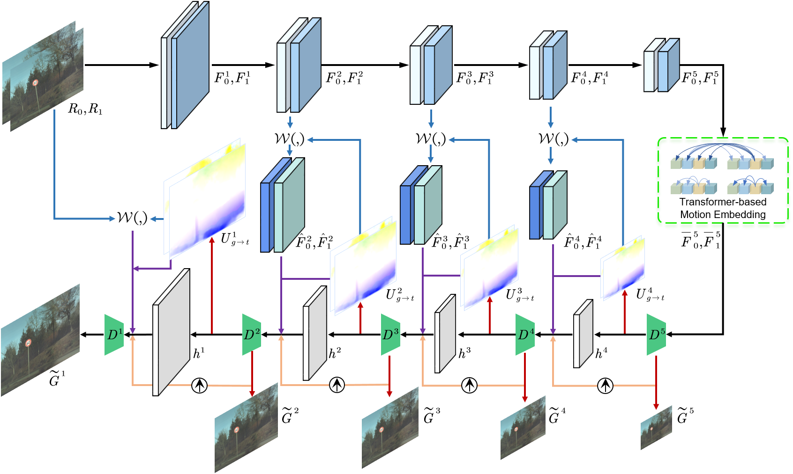
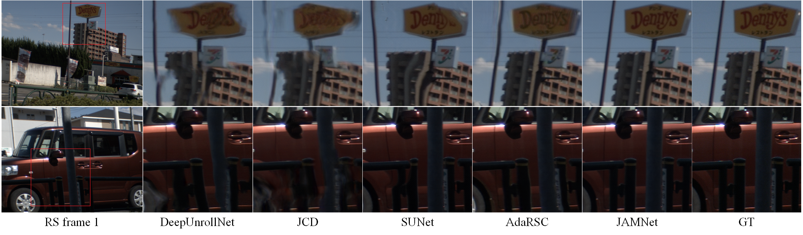

# Joint Appearance and Motion Learning for Efficient Rolling Shutter Correction

This repository contains the source code for the paper: [Joint Appearance and Motion Learning for Efficient Rolling Shutter Correction (CVPR2023)](https://openaccess.thecvf.com/content/CVPR2023/papers/Fan_Joint_Appearance_and_Motion_Learning_for_Efficient_Rolling_Shutter_Correction_CVPR_2023_paper.pdf).
Rolling shutter correction (RSC) is becoming increasingly popular for RS cameras that are widely used in commercial and industrial applications. Despite the promising performance, existing RSC methods typically employ a two-stage network structure that ignores intrinsic information interactions and hinders fast inference. In this paper, we propose a **single-stage** encoder-decoder-based network, named **JAMNet**, for efficient RSC. It first extracts pyramid features from consecutive RS inputs, and then simultaneously refines the two complementary information (i.e., global shutter appearance and undistortion motion field) to achieve mutual promotion in a joint learning decoder. To inject sufficient motion cues for guiding joint learning, we introduce a transformer-based motion embedding module and propose to pass hidden states across pyramid levels. 
Moreover, we present a new data augmentation strategy **vertical flip + inverse order** to release the potential of the RSC datasets. Experiments on various benchmarks show that our approach surpasses the state-of-the-art methods by a large margin, especially with a 4.7 dB PSNR leap on real-world RSC. Further, our network achieves real-time inference for the first time and enjoys a flexible design. 



 

## Installation
The code is tested with PyTorch 1.9.1 with CUDA 11.4.

Install the dependent packages:
```
pip install -r requirements.txt
```

Note that [detectron2](https://github.com/facebookresearch/detectron2) needs to be installed.

In our implementation, we borrowed the code framework of [DeepUnrollNet](https://github.com/ethliup/DeepUnrollNet):

#### Install core package
```
cd ./package_core
python setup.py install
```

## Demo with our pretrained model
One can test our method with the provided images in the `demo` folder.

To generate the global shutter images corresponding to the middle scanline, simply run
```
sh demo.sh
```
The visualization results will be stored in the `experiments` folder. Note that additional examples in the RSC dataset can be tested similarly.

## Datasets
- **Carla-RS** and **Fastec-RS:** Download these two datasets to your local computer from [here](https://github.com/ethliup/DeepUnrollNet).
- **BS-RSC:** Download this real-world dataset to your local computer from [here](https://github.com/ljzycmd/BSRSC).

## Training and evaluating
You can run following commands to re-train the network.
```
# !! Please update the corresponding paths in 'train_carla.sh', 'train_fastec.sh' and 'train_bsrsc.sh'  #
# !! with your own local paths, before run following command!!      #

sh train_carla.sh
sh train_fastec.sh
sh train_bsrsc.sh
```

You can run following commands to obtain the quantitative evaluations.
```
# !! Please update the path to test data in 'inference.sh'
# !! with your own local path, before run following command!!

sh inference.sh
```

## Citations
Please cite our paper if necessary:
```
@inproceedings{fan_JAMNet_CVPR23,
  title={Joint Appearance and Motion Learning for Efficient Rolling Shutter Correction},
  author={Fan, Bin and Mao, Yuxin and Dai, Yuchao and Wan, Zhexiong and Liu, Qi},
  booktitle={Proceedings of the IEEE/CVF Conference on Computer Vision and Pattern Recognition},
  pages={5671--5681},
  year={2023}
}
```

## Statement
This project is for research purpose only, please contact us for the licence of commercial use. For any other questions or discussion please contact: binfan@mail.nwpu.edu.cn
